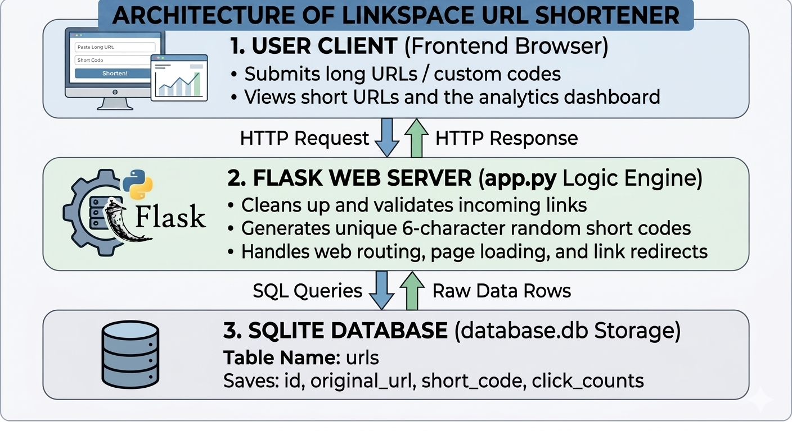
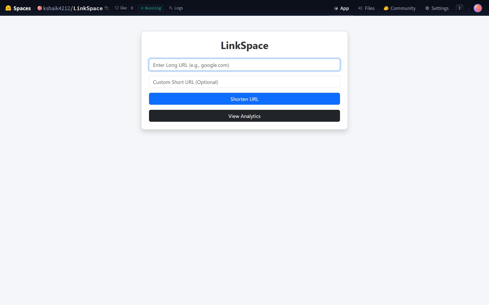
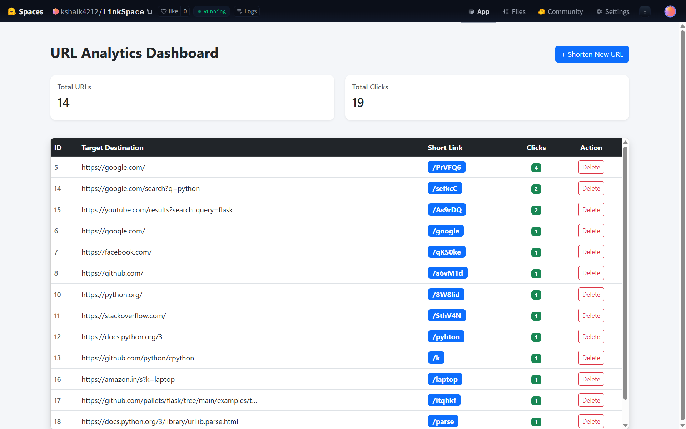

# 🔗 LinkSpace - URL Shortener Application

LinkSpace is a lightweight, efficient, and user-friendly **URL Shortener Application** built using Python and Flask. It allows users to convert long, bulky web links into compact, shareable short codes, complete with an analytics tracking dashboard.

🚀 **[Click Here for the Live Application Demo on Hugging Face Spaces](https://huggingface.co/spaces/kshaik4212/LinkSpace)**

---

## 🛠️ Application Features
* **URL Sanitization & Validation**: Automatically formats missing protocols (`https://`) and strips malicious strings.
* **Custom Short Code Aliases**: Gives users the option to choose their own custom, memorable short link slugs.
* **Collision-Resistant Hash Engine**: Generates unique, secure 6-character random tracking strings.
* **Real-Time Analytics Dashboard**: Tracks total application link counts and aggregates user click traffic metrics.
* **Data Lifecycle Management**: Offers instant row deletion mechanics to prune or refresh stored databases.

---

## 🏗️ System Architecture

The project uses a clean **3-Tier Monolithic Architecture** following the Model-View-Controller design workflow. It is fully containerized and hosted securely in the cloud.



---

## 📸 Screenshots & Interface Preview

### 1. Main Link Creation Portal
Paste your target destination, assign an optional unique keyword string, and click shorten.


### 2. URL Analytics Leaderboard Dashboard
Monitor your active production database links, view running click counters, or remove old records instantly.


---

## 💻 How to Run Locally

### 1. Clone the Workspace Repository
```bash
git clone https://github.com
cd LinkSpace
```

### 2. Set Up a Virtual Environment & Dependencies
```bash
python -m venv venv
source venv/bin/activate  # On Windows use: venv\Scripts\activate
pip install -r requirements.txt
```

### 3. Initialize and Start the Local Web Server
```bash
python app.py
```
Open your web browser and navigate to `http://127.0.0.1:5000` to interact with your local instance!

---

## 🛢️ Database Schema Blueprint
The system creates and communicates with an internal `database.db` relational schema containing a core structural dataset table:

| Field Name | Data Storage Type | Rules / Constraints | Purpose Description |
| :--- | :--- | :--- | :--- |
| **id** | INTEGER | PRIMARY KEY AUTOINCREMENT | System Unique Row Reference Identifier |
| **original_url** | TEXT | NOT NULL | Target Destination Website Address Link |
| **short_code** | TEXT | UNIQUE NOT NULL | Redirect Route Path Hash Key or Custom Alias |
| **clicks** | INTEGER | DEFAULT 0 | Performance Counter Tracking Metric |
